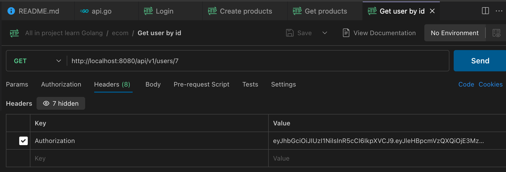
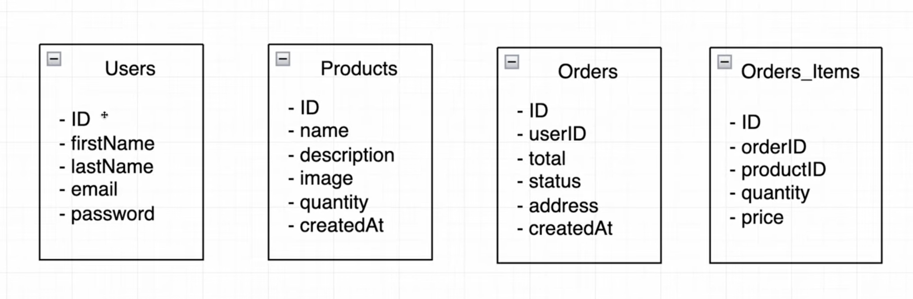

## E-commerce REST API in Go

[Video Tutorial](https://www.youtube.com/watch?v=7VLmLOiQ3ck&list=PLYEESps429vrFV0yiN_MCaDPhnYb0qRxK)

All request call api in folder ecom (postman)

**When calling an API, authorization is required:**

1. **Login** to obtain a token.
2. **Copy the token** from the response.
3. **Go to the Headers** section.
4. **Create a key** named `Authorization` and paste the copied token as its value.



---

# API Flow Documentation

## **Flow Explanation**

1. **User Requests**

   - The user interacts with the system through HTTP requests.

2. **API Server (Dockerized)**

   - The API server, running inside a **Docker container**, handles user requests and interacts with the **MySQL database**.

3. **Authentication & Authorization (🔑)**

   - Some routes require authentication (represented by the key icons), meaning the user must provide valid credentials (e.g., a token).

---

## **Endpoints & Their Roles**

### **1. `GET /users/{id}`** 🔑

- Fetches user information based on `id`.
- Requires authentication.

### **2. `POST /register`**

- Registers a new user in the system.
- No authentication needed.

### **3. `POST /login`**

- Allows a user to log in and receive an authentication token.
- No authentication needed.

### **4. `GET /products`** 🔑

- Retrieves a list of available products.
- Requires authentication.

### **5. `POST /cart/checkout`** 🔑

- Processes the user’s checkout.
- Requires authentication.

---

## **Backend Components**

### **Dockerized API Server**

- The API server runs inside a **Docker container**, making it portable and easy to deploy.

### **MySQL Database**

- Stores user data, product details, orders, etc.
- The API Server communicates with MySQL to retrieve and store information.

---

## **Conclusion**

- Users interact with the API via HTTP requests.
- The API is containerized with **Docker**.
- The API communicates with a **MySQL database**.
- Some requests require **authentication (JWT or session-based)**.


---

# E-Commerce Database Schema

This document explains the database schema for the e-commerce project.

## 📌 Tables Overview

### 1️⃣ **Users Table**

Stores user information for authentication and order tracking.

- **ID** : Primary key, unique identifier for each user.
- **firstName** & **lastName** : User's full name.
- **email** : Used for login and communication.
- **password** : Encrypted password for authentication.

---

### 2️⃣ **Products Table**

Stores product details for the e-commerce system.

- **ID** : Primary key, unique identifier for each product.
- **name** : Product name.
- **description** : Product details.
- **image** : Image URL or file path.
- **quantity** : Available stock.
- **createdAt** : Timestamp when the product was added.

---

### 3️⃣ **Orders Table**

Stores customer orders.

- **ID** : Primary key, unique identifier for each order.
- **userID** : Foreign key linking to `Users.ID` (who placed the order).
- **total** : Total price of the order.
- **status** : Order status (e.g., pending, shipped, completed).
- **address** : Delivery address.
- **createdAt** : Timestamp when the order was placed.

---

### 4️⃣ **Orders_Items Table** (Join Table)

Handles **many-to-many** relationships between `Orders` and `Products`.

- **ID** : Primary key.
- **orderID** : Foreign key linking to `Orders.ID`.
- **productID** : Foreign key linking to `Products.ID`.
- **quantity** : Number of units ordered.
- **price** : Price per unit at the time of order.

---

## 🔗 **Relationships**

- **One `User` can have many `Orders`** (`Users.ID` → `Orders.userID`).
- **One `Order` can contain multiple `Products`** (via `Orders_Items`).
- **One `Product` can belong to multiple `Orders`** (via `Orders_Items`).

This schema follows **best practices** for relational databases and is optimized for **e-commerce applications** . 🚀



---

In this course we're going to be building a production-ready E-commerce REST API in Go using JWT authentication, we'll be testing our services and connecting our server to a MySQL. We'll build everything from scratch so that I teach you just enough for you to be able to go on your own and not having to watch another video on how to build APIs in Go.

### Installation

There are a few tools that you need to install to run the project.
So make sure you have the following tools installed on your machine.

- [Migrate (for DB migrations)](https://github.com/golang-migrate/migrate/tree/v4.17.0/cmd/migrate)

## Running the project

Firstly make sure you have a MySQL database running on your machine or just swap for any storage you like under `/db`.

Then create a database with the name you want _(`ecom` is the default)_ and run the migrations.

```bash
make migrate-up
```

After that, you can run the project with the following command:

```bash
make run
```

## Running the tests

To run the tests, you can use the following command:

```bash
make test
```
