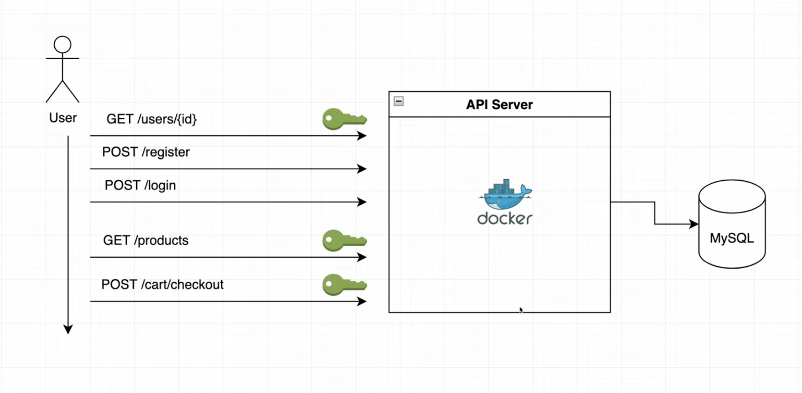

## E-commerce REST API in Go

[Video Tutorial](https://www.youtube.com/watch?v=7VLmLOiQ3ck&list=PLYEESps429vrFV0yiN_MCaDPhnYb0qRxK)



In this course we're going to be building a production-ready E-commerce REST API in Go using JWT authentication, we'll be testing our services and connecting our server to a MySQL. We'll build everything from scratch so that I teach you just enough for you to be able to go on your own and not having to watch another video on how to build APIs in Go.

### Installation

There are a few tools that you need to install to run the project.
So make sure you have the following tools installed on your machine.

- [Migrate (for DB migrations)](https://github.com/golang-migrate/migrate/tree/v4.17.0/cmd/migrate)

## Running the project

Firstly make sure you have a MySQL database running on your machine or just swap for any storage you like under `/db`.

Then create a database with the name you want _(`ecom` is the default)_ and run the migrations.

```bash
make migrate-up
```

After that, you can run the project with the following command:

```bash
make run
```

## Running the tests

To run the tests, you can use the following command:

```bash
make test
```
