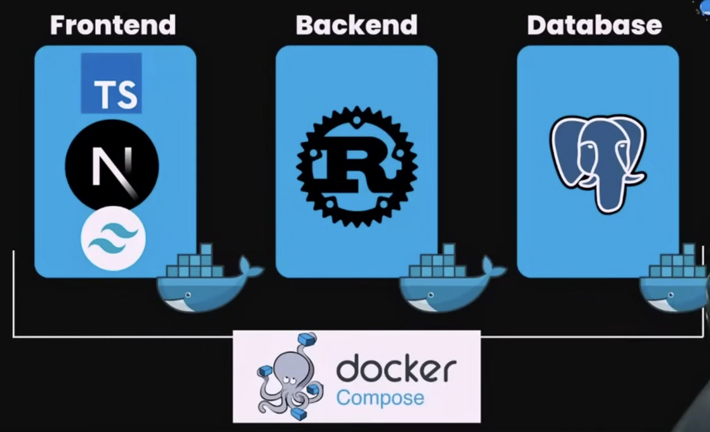
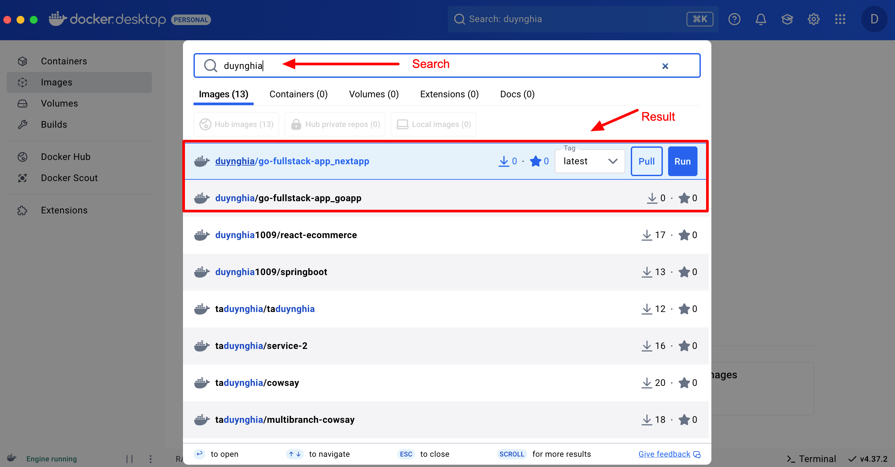

# Uploading Docker Images to Docker Hub

In this project, I have uploaded the images to Docker Hub (to save RAM, I’ve removed the images from my local machine). Next time, you can either pull the images from Docker Hub or run the following command to rebuild the images.

1. Log in to Docker Hub:

```sh
docker login
```

2. Find the container ID (optional step to change the tag name): To find the container ID of the image you want to tag, you can use the following command to list all containers (both running and stopped):

```sh
docker ps -a
```

- This will show a list of all containers along with their IDs. Once you have the container ID, you can use it to tag the image.

3. Tag the images (based on container ID): If you want to change the tag name based on the container ID, you can use the following command format:

```sh
docker tag
```

For example:

```sh
docker tag sha256:f2529a79b8ea1e93c4eebc843bdc702b524428868f84474f8080516f489dd8d5 duynghia/go-fullstack-app_goapp:latest

docker tag sha256:6014f21bcd61a3cee8f5350ee2f24ace33f646d925c5ab0b95a6c83d76d2f7fc duynghia/go-fullstack-app_nextapp:latest
```

4. Push the images: After tagging the images, you can upload them to Docker Hub:

```sh
docker push duynghia/go-fullstack-app_goapp:latest

docker push duynghia/go-fullstack-app_nextapp:latest
```

This way, the images can be easily accessed from Docker Hub when needed!



---

# 🚀 Docker Commands for This Project

## ⚠ Issue: Running Multiple Commands Repeatedly

Each time I run Docker Compose, I have to execute three separate commands:

```sh
docker compose up -d db
docker compose up -d goapp
docker compose up -d nextapp
```

This is repetitive. **How can I run all containers with a single command?**

✅ **Solution:** Run all services at once:

```sh
docker compose up -d
```

This will start **all services** defined in `docker-compose.yml`.

---

# 🛠 Key Docker Commands in This Project

## 📌 1. Connect to PostgreSQL Database in Docker

Run this command to access the PostgreSQL database via the terminal:

```sh
docker exec -it db psql -U postgres
```

## 📌 2. Initialize the Database (`db`) in Docker

This command starts the database container based on `docker-compose.yml`:

```sh
docker compose up -d db
```

## 📌 3. Build the App Image in Docker

Navigate to the `go-fullstack-app` folder and build the Docker image:

```sh
docker compose build
```

## 📌 4. Start the Backend API (`goapp`)

This command creates and starts the `goapp` container:

```sh
docker compose up -d goapp
```

## 📌 5. Start the Frontend (`nextapp`)

This command creates and starts the `nextapp` container:

```sh
docker compose up -d nextapp
```

---

# 🔍 Check Running Containers

To verify that all containers are running, use:

```sh
docker ps -a
```

---

# 🎯 Final Steps: Run Everything with One Command

1. Instead of running separate commands for each service, use:

```sh
docker compose up -d
```

This starts **all services** defined in `docker-compose.yml`.

2. To run the **build process** and **start** the containers immediately, you can use:

Each time edit code, then build again

```
docker compose up --build -d
```

This command builds the images and starts the containers in the background. 🚀

---

This document provides a clear and structured guide for managing Docker containers efficiently. 🚀
