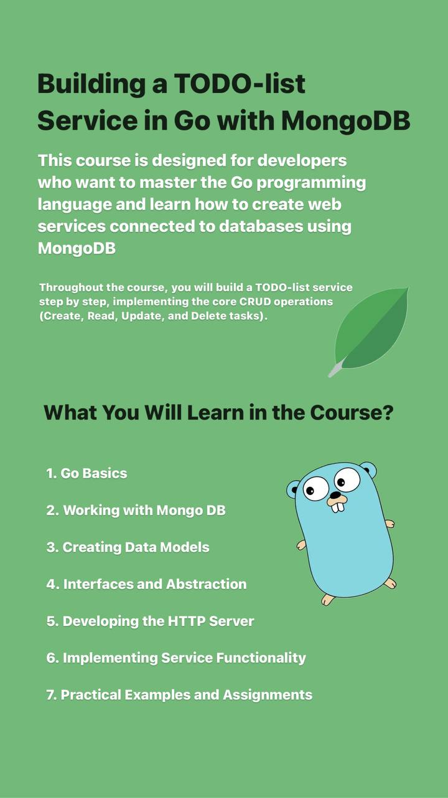

# Golang-workshop

version 0.1.3  
updated: 06/28/2024

Also, practice after each topic and extra coding exercise inside _/practice_ folder

# Topics:

### easy:
1. types
2. for and loops
3. arrays
4. slices
5. maps

### medium:
1. MongoDB
2. HTTP
3. API
4. Interfaces and structures

